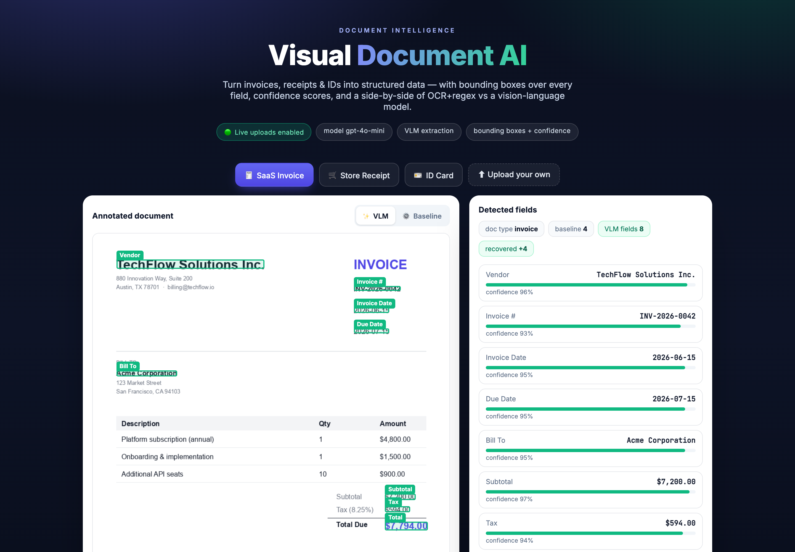
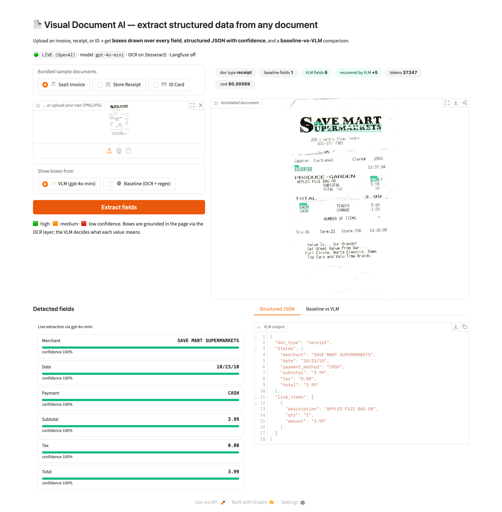

# 📄 Visual Document AI — document data extraction with vision-language models

Upload an **invoice, receipt, or ID** and get back:

1. the page with **confidence-colored boxes** drawn over every detected field,
2. clean **structured JSON** (typed keys + per-field confidence), and
3. a **baseline-vs-VLM** comparison that shows what a vision-language model
   actually buys you over the old OCR-and-regex approach.

This is the "turn documents into data" bucket that almost every business needs —
invoice capture, receipt/expense automation, KYC/ID onboarding.



It also works on **real-world documents you upload**, not just the bundled
samples. Here it's run live (`OPENAI_API_KEY` set) on a real photographed Save
Mart receipt — 6 fields extracted with OCR-grounded boxes, +5 over the baseline:



## How it works


```
        page image
            │
   ┌────────┴─────────┐
   ▼                  ▼
OCR layer        VLM (gpt-4o-mini)
(word boxes)     "what does each value mean?" → typed fields + confidence
   │                  │
   └──── locate ──────┘     each field value is matched back to OCR words
            │               to get its pixel box
            ▼
   annotated page + structured JSON
```

- **OCR / layout layer** (`src/ocr.py`) — pytesseract gives word-level boxes;
  this is where the *boxes* come from (where text is on the page).
- **VLM layer** (`src/llm.py`) — gpt-4o-mini reads the page image and returns
  typed fields with confidence; this is where *meaning* comes from. Each value
  is localized back to OCR words for its box.
- **Baseline** (`src/baseline.py`) — OCR + regular expressions, the "before".
  Great for pattern-shaped fields (dates, totals, invoice #), blind to
  semantic ones (vendor vs bill-to, a person's name, line items).
- **Orchestration** (`src/extract.py`) runs both engines on the same page and
  diffs them field-for-field.

## What it demonstrates

Vision-language extraction · structured output (typed JSON + confidence) ·
OCR/layout grounding for bounding boxes · a measured **baseline vs VLM** case
study · Langfuse observability (token + cost per extraction) · a clone-and-run
demo that needs zero keys.

## Runs with zero keys (MOCK mode)

With **no `OPENAI_API_KEY`**, the app runs in deterministic **MOCK mode** over
three bundled sample documents (a SaaS invoice, a store receipt, a CA ID card).
Boxes and JSON are pixel-perfect because the samples ship with baked ground
truth — so the live demo always works, offline, at no cost.

Set `OPENAI_API_KEY` to run the real VLM on **any document you upload**. Add
`LANGFUSE_*` keys to see every extraction traced with token + cost usage.

## Run it

```bash
python -m venv .venv && source .venv/bin/activate
pip install -r requirements.txt
# OCR for live uploads needs the tesseract binary:
#   macOS: brew install tesseract   ·   Debian/Ubuntu: apt install tesseract-ocr
python app.py            # open the printed local URL
```

Regenerate the sample documents (and their ground truth) with:

```bash
python -m src.samples
```

## Deploy

```bash
pip install huggingface_hub && huggingface-cli login
python deploy_hf.py      # creates a Hugging Face Space, prints the URL
```

`packages.txt` installs `tesseract-ocr` on the Space. Add `OPENAI_API_KEY` as a
Space secret to enable live uploads; until then it serves the MOCK demo.

## Case study

See [`case_study/README.md`](case_study/README.md) — across the three sample
documents the OCR+regex baseline recovers **10 of 21 fields**; the VLM recovers
all 21, picking up exactly the semantic fields (vendor, names, addresses,
subtotals) that regex can't reason about.
